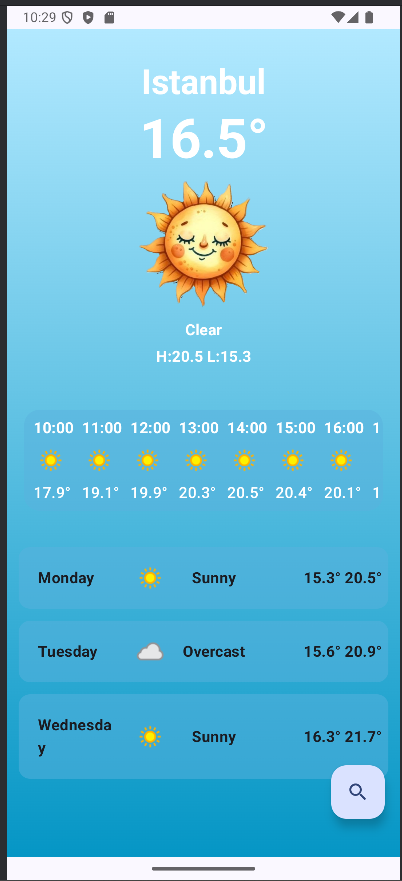
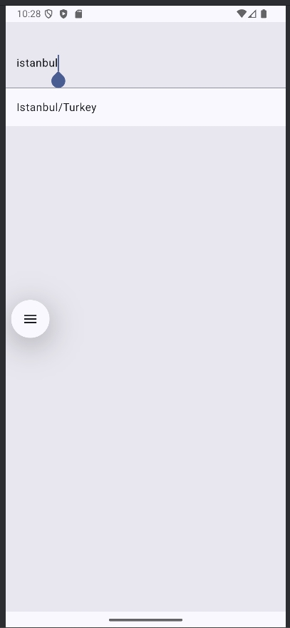
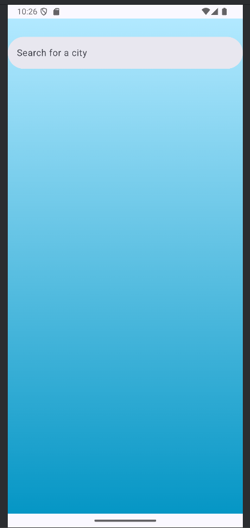
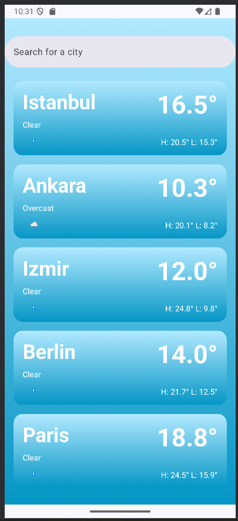
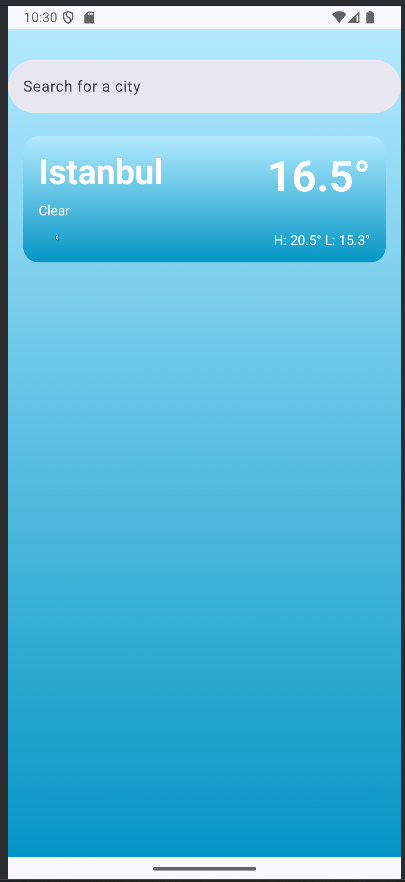

**🌤️ WeatherComposeApp - Jetpack Compose Hava Durumu Uygulaması**

WeatherComposeApp, Android platformu için modern yazılım standartları, Kotlin ve Jetpack Compose kullanılarak geliştirilmiş; kullanıcıya anlık, konum tabanlı ve şehir bazlı detaylı hava durumu verileri sunan bir mobil uygulamadır.

Uygulama, Declarative UI mimarisi, Retrofit tabanlı REST API entegrasyonu, Fused Location API ile otomatik konum tespiti ve MVVM tasarım deseni bileşenlerinden oluşmaktadır.

---
**🌟 Öne Çıkan Özellikler**

**Konum Tabanlı Otomatik Hava Durumu:** Cihazın mevcut koordinatlarını (GPS) kullanarak kullanıcının bulunduğu konumun hava durumu verilerini anında getirir.

**Detaylı Şehir Arama:** Dünyanın her yerinden şehir arama ve aranan şehrin anlık hava verilerini sorgulama.

**Kapsamlı Hava Durumu Detayları:** Sıcaklık, hissedilen sıcaklık, rüzgar hızı, nem oranı ve dinamik durum açıklamaları.

**Reaktif State Yönetimi:** `StateFlow` ve `ViewModel` yapısı sayesinde sayfa geçişlerinde ve veri yüklemelerinde akıcı arayüz güncellemeleri.

**Modern ve Dinamik Arayüz:** Jetpack Compose (Material 3) bileşenleriyle tasarlanmış, esnek ve kullanıcı dostu ekran tasarımı.

---
**📱 Ekran Görüntüleri**

**Ana Arayüz ve Konum Bazlı Hava Durumu**



**Şehir Arama Ekranı**




**Arama Geçmişi**




---
**🛠️ Teknolojik Altyapı ve Kütüphaneler**

**Programlama Dili:** Kotlin

**Arayüz (UI Framework):** Jetpack Compose (Material 3)

**Mimari Desen:** MVVM (Model-View-ViewModel)

**Ağ & REST API:** Retrofit & OkHttp

**JSON Dönüştürücü:** Gson Converter

**Asenkron / Senkronizasyon:** Kotlin Coroutines & Flow / StateFlow

**Konum Servisi:** Google Play Services - Fused Location Provider API

---
**🚀 Kurulum ve Çalıştırma**
Projeyi bilgisayarınızda veya cihazınızda çalıştırmak için aşağıdaki adımları sırasıyla uygulayın:
1. Ön Koşullar
Android Studio: Ladybug veya üzeri güncel bir sürüm
JDK Version: Java 17+
Minimum Android SDK: API Level 24 (Android 7.0) veya üzeri
3. Repoyu Klonlayın
```bash
git clone https://github.com/merveAydinDev/WeatherComposeApp.git
cd WeatherComposeApp
```
3. Projeyi Derleyin ve Çalıştırın
Android Studio'yu açın ve Open Project diyerek klonladığınız klasörü seçin.
Gradle paketlerinin yüklenmesi için Gradle Sync işleminin tamamlanmasını bekleyin.
Uygulamayı bir Android Emülatöründe veya fiziksel bir cihazda Run (Shift + F10) butonuna basarak başlatın.
---
**💡 Kullanım Adımları**

Konum İzni Verme:

Uygulama ilk açıldığında konum izni ister. İzin verildiğinde Fused Location API aracılığıyla mevcut konumunuzun hava durumu otomatik yüklenir.

Şehir Arama:

Arama ekranına geçerek üstteki arama çubuğuna hava durumunu merak ettiğiniz şehrin adını yazın.

Detayları İnceleme:

Ekranda görüntülenen anlık sıcaklık, rüzgar hızı, nem ve hava durumu grafiksel simgelerini inceleyin.

---
**📁 Proje Klasör Yapısı**
```text
WeatherComposeApp/
│
├── app/src/main/java/com/merveaydin/weatherhomeworkcompose/
│   ├── model/           # API veri modelleri ve ViewState sınıfları
│   │   ├── WeatherModel.kt
│   │   └── SearchViewModel.kt
│   │
│   ├── screen/          # Jetpack Compose arayüz ekranları
│   │   ├── MainScreen.kt
│   │   └── SearchScreen.kt
│   │
│   ├── service/         # Retrofit API servisleri ve konum servisleri
│   │   ├── WeatherAPI.kt
│   │   └── LocationApi.kt
│   │
│   ├── ui/theme/        # Renk, tipografi ve tema yapılandırmaları
│   │   ├── Color.kt
│   │   ├── Theme.kt
│   │   └── Type.kt
│   │
│   └── MainActivity.kt  # Uygulama ana giriş noktası (Entry point)
│
├── .gitignore           # Git izleme dışı dosyaları (.idea, build, .kotlin, vs.)
└── README.md            # Proje dokümantasyonu
```
---
✉️ İletişim

Merve Aydın

GitHub: @merveAydinDev
